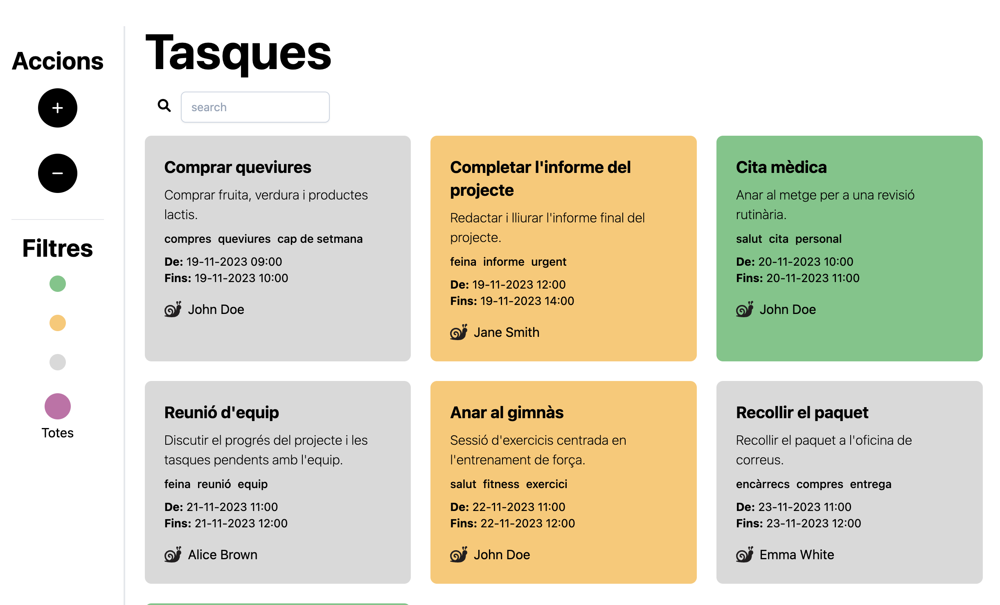

# Tasques  
Yet another task management app, but with cool colors. 💅  

## ⚙️ How to install  
1. `git clone git@github.com:Kaylen7/Sprint3-Developers.git tasques` this repository.  
2. `cd tasques/web`  
3. `php -S localhost:8000` 

You can now browse your tasks in `localhost:8000`.

## 💄 Features  
- Persistance of tasks implemented with `config/database.json`.  
- Batch-deleting of tasks allowed in `/delete` view. 
- Main view with task filters: by task state or by searching text in title and description 🔥.  

## 👾 Technologies  
- Clone of [initialPhp](https://github.com/IT-Academy-BCN/phpInitialDemo).
- PHP 8.3.14
- TailwindCSS (custom `styles.css` for color palette 🎨).
- plain JS and HTML  

## 🤝 Contributions  
This project was made by [@AlexP953](https://github.com/AlexP953) and [@Kaylen7](https://github.com/Kaylen7/).  
Feel free to contribute.   

